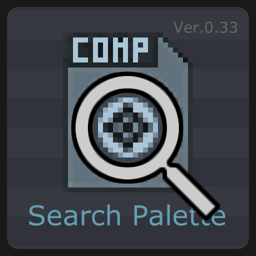

# TD-SearchPalette

A TouchDesigner UI-Addon for searching palette.

Drag and drop the component anywhere on the network (recommended to be the root) and it will be installed automatically.

If you turn on the "Auto Install at startup" parameter, this component will be installed each time the project is started.

---
https://github.com/yeataro/TD-SearchPalette

Author : Yea Chen <yeataro@gmail.com>

