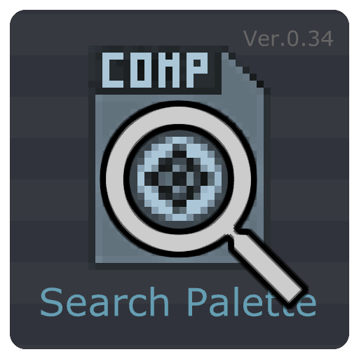
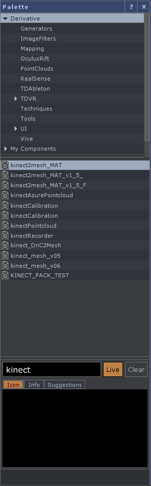
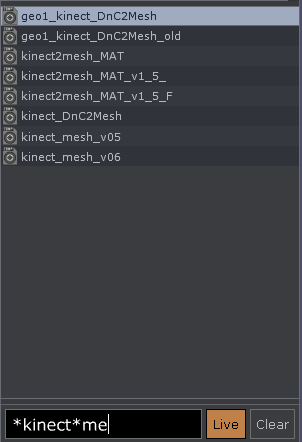
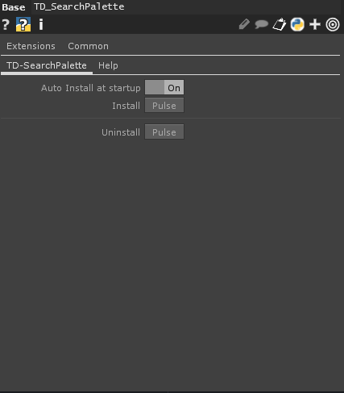

# TD-SearchPalette

A TouchDesigner UI-Addon for searching palette.

Drag and drop the component anywhere on the network (recommended to be the root) and it will be installed automatically.

Use asterisks to match any string of any length.

Turn on the "Live" button to search in real time while typing (if you are performing, it will affect the performance a little bit)

If you turn on the "Auto Install at startup" parameter, this component will be installed each time the project is started.
 

---
https://github.com/yeataro/TD-SearchPalette

Author : Yea Chen <yeataro@gmail.com>